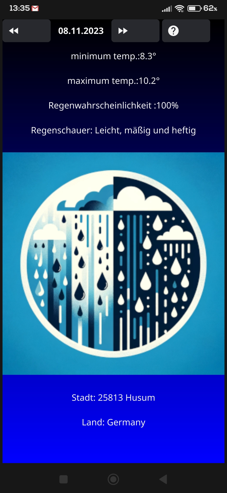

Ein einfaches Wetter Tool geschrieben in Go mit dem Fyne GUI Framework.
Es ist gedacht für Android, aber ich habe auch Releases für Linux und Windows bereitgestellt.
Wetter API: Open-Meteo ; Location API: BigDataCloud.

